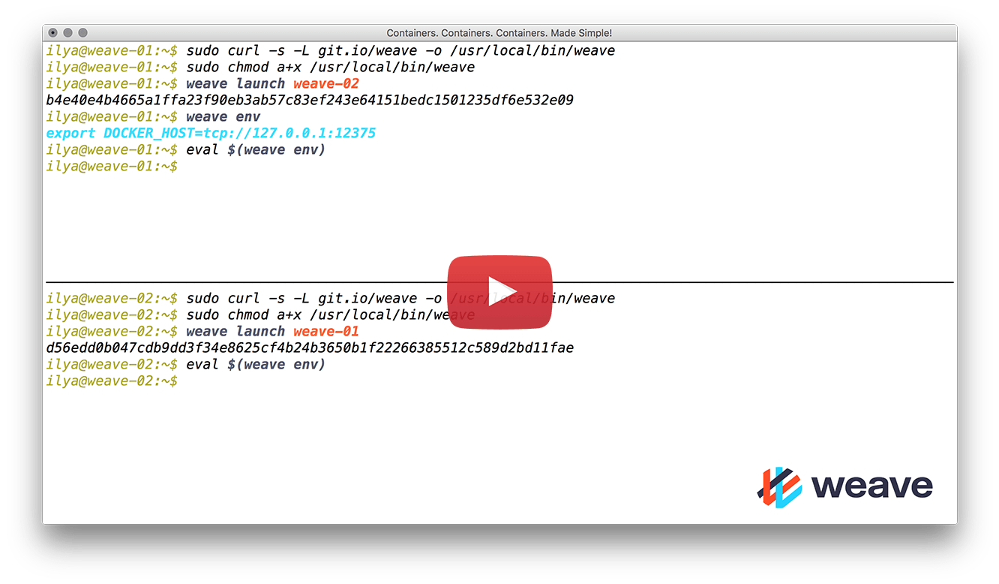

Ensure you are running Linux (kernel 3.8 or later) and have Docker
(version 1.6.0 or later) installed. 

Install Weave Net by running the following:

    sudo curl -L git.io/weave -o /usr/local/bin/weave
    sudo chmod a+x /usr/local/bin/weave

If you are on OSX and are using Docker Machine you need to make sure
that a VM is running and configured before getting Weave Net. Setting up a VM is shown in [the Docker Machine
documentation](https://docs.docker.com/installation/mac/#from-your-shell).
After the VM is configured with Docker Machine, Weave Net can be launched directly from the OSX host.

Weave Net respects the environment variable `DOCKER_HOST`, so that you can run
and control a Weave Network locally on a remote host. See [Using The Weave Docker API Proxy](/site/weave-docker-api/using-proxy.md).

With Weave Net downloaded onto your VMs or hosts, you are ready to launch a Weave network and deploy apps onto it. See [Using Weave Net](/site/using-weave.md).

###Quick Start Screencast

###Guides for specific platforms

CoreOS users see [here](/guides/networking-docker-containers-with-weave-on-coreos/) for an example of installing Weave using cloud-config.

Amazon AWS users may want to use AWSVPC?

Amazon ECS users see [here](https://github.com/weaveworks/integrations/blob/master/aws/ecs/README.md)
for the latest Weave AMIs and [here](http://weave.works/guides/service-discovery-with-weave-aws-ecs.html) to get started with Weave Net on ECS.

**See Also** 

 * [Using Weave Net](/site/using-weave.md)
 * [Getting Started Guides](http://www.weave.works/guides/)
 * [Features](/site/features.md)
 * [Troubleshooting](/site/troubleshooting.md)
 * [Building](/site/building.md)
 * [Using Weave with Systemd](/site/installing-weave/systemd.md)
 
